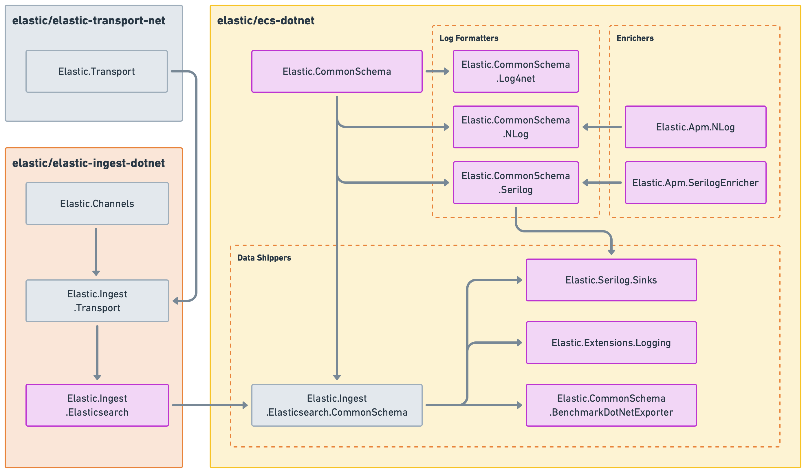

---
mapped_pages:
  # TO DO: Do we want this in addition to an intro page?
  - https://www.elastic.co/guide/en/ecs-logging/dotnet/current/index.html
  - https://www.elastic.co/guide/en/ecs-logging/dotnet/current/intro.html
---

# ECS Logging .NET [intro]

ECS logging are integrations for your favorite .NET logging libraries. They make it easy to format your logs into ECS-compatible JSON.

::::{tip}
Want to learn more about ECS, ECS logging, and other available language plugins? See the [ECS logging overview](ecs-logging://reference/intro.md).
::::


The .NET ECS libraries fall into several categories:


## Model [_model]

At its core all .NET ECS libraries are powered by `Elastic.CommonSchema` which strongly types the ECS specification to .NET classes.

This library can be used to map your events to ECS in a typesafe fashion.

```csharp
var doc = EcsDocument.CreateNewWithDefaults<EcsDocument>();
doc = new EcsDocument();
```

[Lean more about Elastic.CommonSchema](/reference/ecs-dotnet.md).


## Log formatters [_log_formatters]

Our log formatters allow you to change the way various logging frameworks log to IO (file/console) to use ECS json.

* [`Elastic.CommonSchema.Serilog`](/reference/serilog-formatter.md)
* [`Elastic.CommonSchema.NLog`](/reference/nlog-formatter.md)
* [`Elastic.CommonSchema.Log4Net`](/reference/log4net-formatter.md)


## Data shippers [_data_shippers]

Our datashippers integrate with logging frameworks to facilitate sending events (logs) to various off Elastic receivers.

Currently these shippers support Elastic Cloud & Elasticsearch but other outputs are in the works.

* [`Elastic.Serilog.Sinks`](/reference/serilog-data-shipper.md)
* [`Elastic.Extensions.Logging`](/reference/extensions-logging-data-shipper.md)
* [`Elastic.CommonSchema.BenchmarkDotNetExporter`](/reference/benchmark-dotnet-data-shipper.md)

All the data shippers utilize [`Elastic.Ingest.Elasticsearch.CommonSchema`](/reference/ecs-ingest-channels.md) to send events to Elasticsearch.


## Enrichers [_enrichers]

Enrichers can be installed next to `Log Formatters` and `Data Shippers` to automatically enrich the ECS json that gets produced.

* [`Elastic.Apm.SerilogEnricher`](/reference/apm-serilog-enricher.md)
* [`Elastic.Apm.NLog`](/reference/apm-nlog-enricher.md)


## Architecture [_architecture]

The libraries reuse the same components that power other .NET libraries from Elastic—​ensuring a common way to both configure and monitor Elastic’s .NET libraries.



At its core all data shippers depend on [Elastic.Transport](https://github.com/elastic/elastic-transport-net) to coordinate HttpRequests. This library is also the heart of Elastic’s clients and ensures we share best practices and configuration options.

The data shipper libraries all depend upon the push based ingestion abstractions from [Elastic.Ingest.*](https://github.com/elastic/elastic-ingest-dotnet) that presents an easy to use `System.Threading.Channels` backed method to push events as batches at variable rates to external datasources.

[Lean more about Elastic.Ingest.Elasticsearch.CommonSchema](/reference/ecs-ingest-channels.md).
