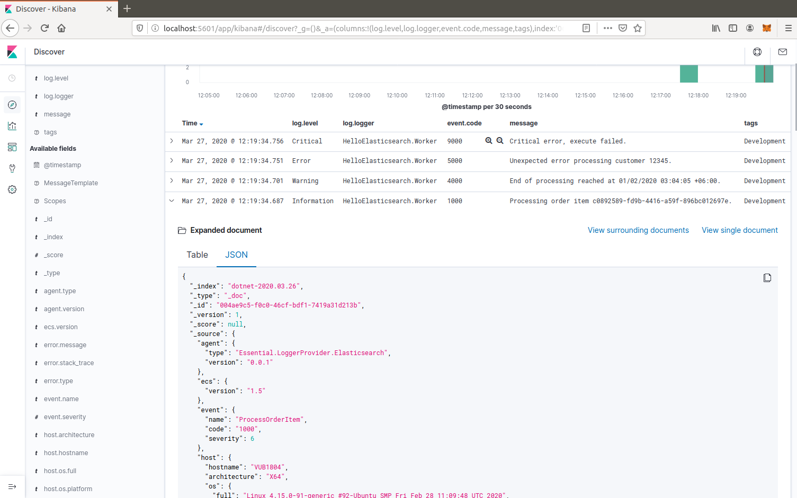

# Console example with Elasticsearch.Extensions.Logging 

This example uses a stand alone logger provider, [Elasticsearch.Extensions.Logging](../../src/Elasticsearch.Extensions.Logging), that integrates directly with Microsoft.Extensions.Logging, and uses the Elastic Common Schema library.

The example also uses LoggerMessage for [high performance logging](https://docs.microsoft.com/en-us/aspnet/core/fundamentals/logging/loggermessage).

## Usage

Add a reference to the `Elasticsearch.Extensions.Logging` package:

```powershell
dotnet add package Elasticsearch.Extensions.Logging
```

Then, add the provider to the loggingBuilder during host construction, using the namespace and the provided extension method. 

```c#
using Elasticsearch.Extensions.Logging;

// ...

    .ConfigureLogging((hostContext, loggingBuilder) =>
    {
        loggingBuilder.AddElasticsearch();
    })
```

The default configuration will write to a local Elasticsearch running at http://localhost:9200/.

For more details on configuration, see [Elasticsearch.Extensions.Logging](../../src/Elasticsearch.Extensions.Logging).

## Running the sample

You need to be running Elasticsearch and Kibana. A docker compose configuration is provided, to run on either Linux,
or using Docker Desktop (see https://docs.docker.com/docker-for-windows/). The provided configuration will create two nodes, one for Elasticsearch, and one for Kibana:

```powershell
docker-compose -f ./examples/console-with-extensions-logging/docker-compose.yml start
```

Then run the example:

```powershell
dotnet run --project ./examples/console-with-extensions-logging
```

Open a browser to the Kibana application (http://localhost:5601/) and create the index pattern "dotnet-*", with the time filter "@timestamp".

Some useful columns to add are `log.level`, `log.logger`, `event.code`, `message`, `tags`, and `process.thread.id`. Custom 
key/value pairs are logged as `labels.*`, e.g. `labels.CustomerId`.

**Example output: Elasticsearch via Kibana** 



## Example Document

Document fields follows the Elastic Common Schema standards (using the library), with a derived base class conta two custom fields, MessageTemplate and Scopes, for the convention for variant casing.

```json
{
  "_index": "dotnet-2020.04.12",
  "_type": "_doc",
  "_id": "563503a8-9d10-46ff-a09f-c6ccbf124db9",
  "_version": 1,
  "_score": null,
  "_source": {
    "MessageTemplate": "Unexpected error processing customer {CustomerId}.",
    "Scopes": [
      "IP address 2001:db8:85a3::8a2e:370:7334",
      "PlainScope"
    ],
    "agent": {
      "version": "1.0.0+bd3ad6",
      "type": "Elasticsearch.Extensions.Logging.LoggerProvider"
    },
    "ecs": {
      "version": "1.5.0"
    },
    "error": {
      "message": "Calculation error",
      "type": "System.Exception",
      "stack_trace": "System.Exception: Calculation error\n ---> System.DivideByZeroException: Attempted to divide by zero.\n   at HelloElasticsearch.Worker.ExecuteAsync(CancellationToken stoppingToken) in /home/sly/Code/essential-logging/examples/HelloElasticsearch/Worker.cs:line 80\n   --- End of inner exception stack trace ---\n   at HelloElasticsearch.Worker.ExecuteAsync(CancellationToken stoppingToken) in /home/sly/Code/essential-logging/examples/HelloElasticsearch/Worker.cs:line 84"
    },
    "event": {
      "code": "5000",
      "action": "ErrorProcessingCustomer",
      "severity": 3
    },
    "host": {
      "os": {
        "platform": "Unix",
        "full": "Linux 4.15.0-91-generic #92-Ubuntu SMP Fri Feb 28 11:09:48 UTC 2020",
        "version": "4.15.0.91"
      },
      "hostname": "VUB1804",
      "architecture": "X64"
    },
    "log": {
      "level": "Error",
      "logger": "HelloElasticsearch.Worker"
    },
    "process": {
      "thread": {
        "id": 10
      },
      "pid": 25982,
      "name": "HelloElasticsearch"
    },
    "service": {
      "type": "HelloElasticsearch",
      "version": "1.0.0"
    },
    "user": {
      "id": "sgryphon+es@live.com",
      "name": "sly",
      "domain": "VUB1804"
    },
    "@timestamp": "2020-04-13T21:25:22.3352989+10:00",
    "tags": [
      "Development"
    ],
    "labels": {
      "ip": "2001:db8:85a3::8a2e:370:7334",
      "CustomerId": "12345"
    },
    "message": "Unexpected error processing customer 12345.",
    "trace": {
      "id": "c20bde1071f7cf4e9a6f368c824e05f7"
    },
    "transaction": {
      "id": "92ba5ee64d963746"
    }
  },
  "fields": {
    "@timestamp": [
      "2020-04-13T11:25:22.335Z"
    ]
  },
  "sort": [
    1586777122335
  ]
}
```
