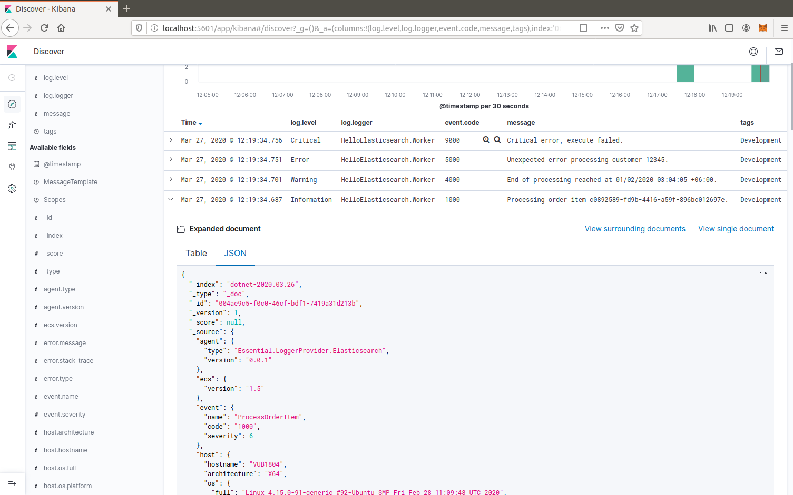

# Elasticsearch Logger Provider

Elasticsearch-Logstash-Kibana (ELK) stack logger provider for Microsoft.Extensions.Logging.

Writes direct to Elasticsearch using the [Elastic Common Schema (ECS)](https://www.elastic.co/guide/en/ecs/current/ecs-reference.html), 
with semantic logging of structured data from message and scope values. The results can be viewed and queried in the Kibana console.

The logger uses the [Elasticsearch.Net low level client](https://github.com/elastic/elasticsearch-net) to
manage the network connection to Elasticsearch.

## Usage

Add a reference to the `Elasticsearch.Extensions.Logging` package:

```powershell
dotnet add package Elasticsearch.Extensions.Logging
```

Then, add the provider to the loggingBuilder during host construction, using the provided extension method. 

```c#
using Elasticsearch.Extensions.Logging;

// ...

    .ConfigureLogging((hostContext, loggingBuilder) =>
    {
        loggingBuilder.AddElasticsearch();
    })
```

The default configuration will write to a local Elasticsearch running at http://localhost:9200/.

Once you have sent some log event, open Kibana (e.g. http://localhost:5601/) and define an 
index pattern for "dotnet-*" with the time filter "@timestamp".

You can then discover the log events for the index. Some useful columns to add 
are `log.level`, `log.logger`, `event.code`, `message`, `tags`, and `process.thread.id`.

If you are running multiple applications or on multiple servers, you might want to
include `service.type`, `service.version`, and `host.hostname`.

Additional fields are defined below, and all individual message and scope values are logged 
as `labels.*` custom key/value pairs, e.g. `labels.CustomerId`.

### Basic configuration

For deployment you will usually want to override the configuration with your actual server location(s).
The other useful value to configure is a tag for the environment, e.g. Development/Staging/Production.

```json
{
  "Logging": {
    "Elasticsearch": {
      "NodeUris": [ "https://elastic-staging.example.com:9200" ],
      "Tags": [ "Staging" ]
    }
  }
}
```

**NOTE:** You don't need any configuration to just use a local Elasticsearch instance, as it defaults to http://localhost:9200/.

### Example program

* See [Console with Extensions.Logging](../../examples/console-with-extensions-logging)




## Configuration settings

The logger provider will be automatically configured with any logging settings under the alias `Elasticsearch`. 

The following default settings are used.

```json
{
  "Logging": {
    "Elasticsearch": {
      "IncludeHost": true,
      "IncludeProcess": true,
      "IncludeScopes": true,
      "IncludeUser": true,
      "Index": "dotnet-{0:yyyy.MM.dd}",
      "IndexOffset": null,
      "IsEnabled": true,
      "ListSeparator": ", ",
      "MapCorrelationValues": true,
      "Tags": [],
      "ShipTo": {
        "NodePoolType": "SingleNode",
        "NodeUris": [ "http://localhost:9200" ]
      }
    }
  }
}
```

| Setting | Type | Description |
| ------- | ---- | ----------- |
| IncludeHost | boolean | Default `true`; set to `false` to disable logging host values. |
| IncludeProcess | boolean | Default `true`; set to `false` to disable logging process values. |
| IncludeScopes | boolean | Default `true`; set to `false` to disable logging scope values. |
| IncludeUser | boolean | Default `true`; set to `false` to disable logging user details. |
| Index | format | Format string used to generate the Elasticsearch `index`, using the current timestamp. Default is `dotnet-{0:yyyy.MM.dd}`. |
| IndexOffset | timespan | Override to set the offset used to generate the `index`. Default value is `null`, which uses the system local offset; use `"00:00"` for UTC.  |
| IsEnabled | boolean | Default `true`; set to `false` to disable the logger. |
| ListSeparator | string | Separator to use for `IEnumerable` in `labels.*` values. Default is `", "`. |
| Tags | array | Additional tags to include in the message. Useful to specify the environment or other details, e.g.  `[ "Staging", "Priority" ]` |

The ShipTo settings can have the following properties, depending on the type of connection pool.

| Setting      | Type | Description |
|--------------| ---- | ----------- |
| ApiKey       | string | API Key, where connection pool type is Cloud, and authenticating via API Key. |
| CloudId      | string | Cloud ID, where connection pool type is Cloud. |
| NodePoolType | enum | Default is `Singlenode`, or `Sniffing` for multiple nodes, or `Cloud` if `CloudId` is provided. Other supported values are `Static` or `Sticky`. |
| NodeUris     | array | URI(s) of the Elasticsearch nodes to connect to. Default is a single node `[ "http://localhost:9200" ]` |
| Password     | string | Password, where connection pool type is Cloud, and authenticating via username/password. |
| Username     | string | Username, where connection pool type is Cloud, and authenticating via username/password. |

If you want to configure from a different section, it can be configured manually:

```c#
    .ConfigureLogging((hostContext, loggingBuilder) =>
    {
        loggingBuilder.AddElasticsearch(options =>
            hostContext.Configuration.Bind("Logging:CustomElasticsearch", options));
    })
```

Configuration can, of course, also be done in code, e.g. to add the environment as a tag.

### Elastic Cloud configuration

If `CloudId` is provided, the `ConnectionPoolType` defaults to `Cloud`:

```json
{
  "Logging": {
    "Elasticsearch": {
      "ShipTo": {
        "CloudId": "12345",
        "ApiKey": "abcdef"
      }
    }
  }
}
```


## Output - Elastic Common Schema (ECS)

Log messages sent to Elasticsearch follow the [Elastic Common Schema (ECS)](https://www.elastic.co/guide/en/ecs/current/ecs-reference.html).

### Example document

The `_source` field is the message sent from the LoggerProvider, along with the `_index` and `_id` (a GUID).

```json
{
  "_index": "dotnet-2020.04.12",
  "_type": "_doc",
  "_id": "563503a8-9d10-46ff-a09f-c6ccbf124db9",
  "_version": 1,
  "_score": null,
  "_source": {
    "MessageTemplate": "Unexpected error processing customer {CustomerId}.",
    "Scopes": [
      "IP address 2001:db8:85a3::8a2e:370:7334",
      "PlainScope"
    ],
    "agent": {
      "version": "1.0.0+bd3ad6",
      "type": "Elasticsearch.Extensions.Logging.LoggerProvider"
    },
    "ecs": {
      "version": "1.5.0"
    },
    "error": {
      "message": "Calculation error",
      "type": "System.Exception",
      "stack_trace": "System.Exception: Calculation error\n ---> System.DivideByZeroException: Attempted to divide by zero.\n   at HelloElasticsearch.Worker.ExecuteAsync(CancellationToken stoppingToken) in /home/sly/Code/essential-logging/examples/HelloElasticsearch/Worker.cs:line 80\n   --- End of inner exception stack trace ---\n   at HelloElasticsearch.Worker.ExecuteAsync(CancellationToken stoppingToken) in /home/sly/Code/essential-logging/examples/HelloElasticsearch/Worker.cs:line 84"
    },
    "event": {
      "code": "5000",
      "action": "ErrorProcessingCustomer",
      "severity": 3
    },
    "host": {
      "os": {
        "platform": "Unix",
        "full": "Linux 4.15.0-91-generic #92-Ubuntu SMP Fri Feb 28 11:09:48 UTC 2020",
        "version": "4.15.0.91"
      },
      "hostname": "VUB1804",
      "architecture": "X64"
    },
    "log": {
      "level": "Error",
      "logger": "HelloElasticsearch.Worker"
    },
    "process": {
      "thread": {
        "id": 10
      },
      "pid": 25982,
      "name": "HelloElasticsearch"
    },
    "service": {
      "type": "HelloElasticsearch",
      "version": "1.0.0"
    },
    "user": {
      "id": "sgryphon+es@live.com",
      "name": "sly",
      "domain": "VUB1804"
    },
    "@timestamp": "2020-04-13T21:25:22.3352989+10:00",
    "tags": [
      "Development"
    ],
    "labels": {
      "ip": "2001:db8:85a3::8a2e:370:7334",
      "CustomerId": "12345"
    },
    "message": "Unexpected error processing customer 12345.",
    "trace": {
      "id": "c20bde1071f7cf4e9a6f368c824e05f7"
    },
    "transaction": {
      "id": "92ba5ee64d963746"
    }
  },
  "fields": {
    "@timestamp": [
      "2020-04-13T11:25:22.335Z"
    ]
  },
  "sort": [
    1586777122335
  ]
}
```

### Standard Fields

| Field | Type | Description |
| ----- | ---- | ----------- |
| @timestamp | date | `DateTimeOffset` when the message was logged, including local offset. |
| message | string | The formatted log message and arguments. |
| tags | array | Custom tags from configuration, e.g. `[ "Staging", "Priority" ]`. Can have multiple values. |
| event.action | string | The name of the logged EventId, e.g. `ErrorProcessingCustomer`. |
| event.code | string | The numeric value (as a string) of the EventId, e.g. `5000`. |
| event.severity | long | The syslog severity corresponding to the log level, 2 = critical, 3 = error, 4 = warning, 6 = information, 7 = debug and trace. (Also used in the Systemd format of ConsoleLoggerProvider) |
| log.level | string | The log level: `Critical`, `Error`, `Warning`, `Information`, `Debug`, or `Trace`. |
| log.logger | string | The category name (namespace and class) of the logger, e.g. `HelloElasticsearch.Worker`. |

The `event.severity` field is numeric and can be used to order events by level, e.g. Kibana query `event.severity <= 4` will get all messages that have log level `Warning` or worse.

#### Error fields

If the log message includes an exception, the details are reported in the error fields.

| Field | Type | Description |
| ----- | ---- | ----------- |
| error.message | string | The `Message` property of any exception. |
| error.stack_trace | string | Full details of the exception, `Exception.ToString()`, including the stack trace and the stack trace of any inner exceptions. |
| error.type | string | The type of the error message, e.g. `System.DivideByZeroException` |

#### Custom fields

Following the ECS conventions, these use alternative Title casing, to identify them as non-standard fields.

| Field | Type | Description |
| ----- | ---- | ----------- |
| MessageTemplate | string | The original message template, e.g. "Unexpected error processing customer {CustomerId}." |
| Scopes | array | Array of string formatted scope values, in the order added. |

#### Label values

| Field | Type | Description |
| ----- | ---- | ----------- |
| labels.* | string | Custom key/value pairs of all named parameter values and named scope values. All values are strings (no nested objects). | 

Label values can be accessed by their key, for example if the message, or scope, includes a parameter CustomerId, then the value will be logged as `labels.CustomerId` can be searched in Kibana using "labels.CustomerId: 12345".

**Example:**

The following will generate two labels, `labels.EndTime` from the message and `labels.CustomerId` from the scope:

```c#
using (_logger.BeginScope("{CustomerId}", customerId))
{
  _logger.LogWarning("End of processing reached at {EndTime}.", end);
}
```

Labels are taken from the message (state) and any scope values (may be disabled via the configuration options). In Microsoft.Extensions.Logging an 
internal FormattedLogValues is used in the ILogger overloads for log levels and scopes; it implements the `IEnumerable<KeyValuePair<string,object>>` 
interface that is used to extract the individual parameter values.

The `labels` property in ECS should not contain nested objects, so values are converted to keyword strings. For most objects this is just calling ToString(), 
with specific formats for some types, e.g. calling string on a list is usually not very useful, so the contents of the list is logged instead.

**Labels value formatting**

| Type | Formatting |
| ---- | ---------- |
| byte | Hex, e.g. "9A" |
| byte[] | Prefixed hex, e.g. "0x12789AF0" |
| DateTimeOffset | ISO format, e.g. "2020-01-02T03:04:05.000000+06:00" |
| DateTime | In most cases `DateTimeOffset` should be used instead (1). Where `DateTime` is used for date only (with no time component), it is formatted as a date, e.g. "2020-01-02". If it has a time component, the roundtrip ("o") format is used. |
| IEnumerable | Values separated by ", " (configurable) |
| IDictionary<string, object> | A string containing key value pairs, e.g. `token="0x12789AF0" count="5"` |
| *other values* | The result of `ToString()`, including scalar values, e.g. the number `5.3` is logged as the string  "5.3" |

*(1) See https://docs.microsoft.com/en-us/dotnet/standard/datetime/choosing-between-datetime*

### Agent fields

These identify the version of the logger provider being used.

| Field | Type | Description |
| ----- | ---- | ----------- |
| agent.type | string | Name of the logger provider assembly, `Elasticsearch.Extensions.Logging.LoggerProvider`. |
| agent.version | string | Informational version number of the logger assembly, e.g. `1.1.1+bd3ad63`. |
| ecs.version | string | Version of ECS standard used, currently `1.5`. |

### Service fields

This identifies the application/service that is running and generating the logs. 

The values are pulled from the entry assemb, `Assembly.GetEntryAssembly()`, using the `Name` 
and `AssemblyInformationalVersionAttribute` values (if informational version is not set 
it falls back to assembly `Version`).

| Field | Type | Description |
| ----- | ---- | ----------- |
| service.type | string | Name of the entry assembly, `HelloElasticsearch`. |
| service.version | string | Informational version number of the entry assembly, e.g. `1.2.0-beta.1+79d095a`. |

**Note:** You should be using a build process that sets the assembly informational version correctly.
e.g. If you have a dotnet project using git you can install the local tool `GitVersion.Tool`, 
and use it to automatically generate semantic version numbers from the git branch information. 

To install the tool:

```powershell
dotnet new tool-manifest
dotnet tool install GitVersion.Tool
```

Then use the tool to create a semantic version number that can be used in your build process:

```powershell
dotnet tool restore
dotnet gitversion
```

You are welcome to use the [`build.ps1`](../../build.ps1) script in this repository as an example.

### Tracing fields

| Field | Type | Description |
| ----- | ---- | ----------- |
| trace.id | string | Cross-service trace correlation identifier. From `Activity.Current.RootId` from `System.Diagnostics`, with a fallback to `CorrelationManager.ActivityId`. Can be overridden by a message or scope value `trace.id`. |
| transaction.id | string | Transaction for this service, e.g. individual request identifier. If in W3C format, parse out the SpanId from `Activity.Current.Id` from `System.Diagnostics`, otherwise just use the full `Activity.Current.Id` (e.g. if hierarchical). Can be overridden by message or scope value `transaction.id`. |

ASP.NET will automatically pass correlation identifiers between tiers; from 3.0 it also supports the W3C Trace Context standard (https://www.w3.org/TR/trace-context/).

The value of `Activity.Current.RootId` is used as the cross-service identifier (in W3C format this is the Trace ID), 
if in W3C format the Span ID portion of `Activity.Current.Id` is used for the transaction, otherwise the full value is used (this is consistent with the way ASP.NET works).

It is recommended to turn on W3C format, for compatibility with other systems:

```c#
Activity.DefaultIdFormat = ActivityIdFormat.W3C;
```

### Host fields

NOTE: Can be disabled via configuration.

| Field | Type | Description |
| ----- | ---- | ----------- |
| host.architecture | string | The processor architecture, e.g. X64. Value of `RuntimeInformation.OSArchitecture`.|
| host.hostname | string | The computer name. Value of `Environment.MachineName`. |
| host.os.full | string | Full description of the operation system. Value of `RuntimeInformation.OSDescription`. |
| host.os.platform | string | Operating system platform. Value of `Environment.OSVersion.Platform`.  |
| host.os.version | string | Operating system version. Value of `Environment.OSVersion.Version`. |

### Process fields

NOTE: Can be disabled via configuration.

| Field | Type | Description |
| ----- | ---- | ----------- |
| process.name | string | The current process name. From `Process.GetCurrentProcess()`. |
| process.pid | long | The current process ID. From `Process.GetCurrentProcess()`. |
| process.thread.id | long | Current thread ID. Value of `Thread.CurrentThread.ManagedThreadId`. |
| process.thread.name | string | Name of the thread. From `Thread.CurrentThread.Name`. |

### User fields

NOTE: Can be disabled via configuration.

| Field | Type | Description |
| ----- | ---- | ----------- |
| user.domain | string | The current domain, either the machine name or a Windows domain. Value of `Environment.UserDomainName`. |
| user.id | string | Current user principal name, if set. Value of `Thread.CurrentPrincipal.Identity.Name`. |
| user.name | string | The current user. Value of `Environment.UserName`. |
